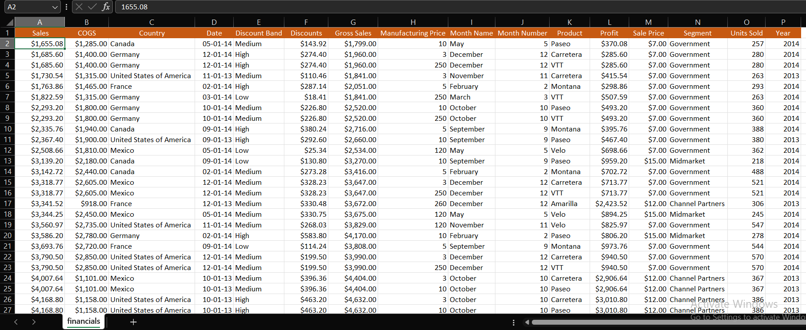

# Company-Financial-Analysis

## INTRODUCTION
This analysis was carried out using excel on a company’s financial dataset. The analysis is done to analyze major aspects of the company’s finances and to answer some questions that might affect the decision making in the company.

## PROBLEM STATEMENT
1. The average revenue generated from each sale of ‘Paseo’
2. The number of sales made in the Government and Midmarket segment
3. The total revenue generated from the sales of ‘Montana’ in Canada
4. In which Country, Segment and Month was the highest unit of goods sold?
5. What is the total profit made in December?

## THE DATASET
The data was already cleaned and arranged properly for analysis. It contained 700 rows of data and 16 columns.

## ANALYSIS

### AVERAGE REVNUE FROM SALES OF PASEO

- For this, I used the average if function on the sales and products column with Paeso as the criteria

- It was deduced that the average revenue the company made from sales of Paseo is $163,421.50

### THE NUMBER OF SALES MADE IN THE GOVERNMENT AND MIDMARKET SEGMENT

- Here, I used the count if function to on the segment section with first government and then midmarket as criteria

- it was deduced that government segment made 300 sales and midmarket made 100 sales bringing it to a total of 400 sales for both segments.

### THE TOTAL REVENUE GENERATED FROM THE SALES OF ‘MONTANA’ IN CANADA

- for this, I used the sumifs function on the sales column, products column with criteria as Montana and country column with criteria as Canada

- it was deduced that the total revenue generated from the sales of Montana in Canada is 2711900

### IN WHICH COUNTRY, SEGMENT AND MONTH WAS THE HIGHEST UNIT OF GOODS SOLD?

- for this, I first solved for the highest units of goods sold using the max function on the units sold column

- Then, I used the VLOOKUP function on the country segment and month name columns to find which had highest units sold.

- from this I found out that the highest unit sold is 4490 and the country segment and month with highest units sold are USA, government, and April respectively.

### TOTAL PROFIT MADE IN DECEMBER
- Here, I used the sumif function on the profit column and the month name column with criteria as decemeber

- The total profit made in december is

## CONCLUSION
this dataset has shown that the 

