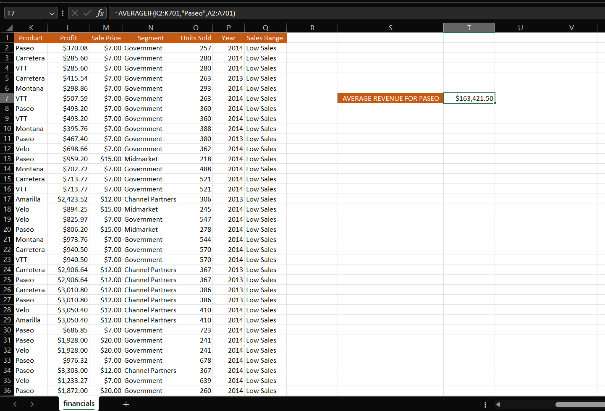

# Company-Financial-Analysis

## INTRODUCTION
This analysis was carried out using excel on a company’s financial dataset. The analysis was done to analyze few aspects of the company’s finances and to answer some questions that might affect the decision making in the company.

## PROBLEM STATEMENT
1. The average revenue generated from each sale of Paseo
2. The number of sales made in the Government and Midmarket segment
3. The total revenue generated from the sales of Montana in Canada
4. In which Country, Segment and Month was the highest unit of goods sold?
5. What is the total profit made in December?

## THE DATASET
The data was already cleaned and arranged properly for analysis. It contained 700 rows of data and 16 columns.

## ANALYSIS

### AVERAGE REVNUE FROM SALES OF PASEO

- For this, I used the **AVERAGEIF** function on the _SALES_ and _PRODUCTS_ column with _PASEO_ as the criteria

- It was deduced that the _AVERAGE REVENUE_ the company made from sales of _PASEO_ is **$163,421.50.**

### THE NUMBER OF SALES MADE IN THE GOVERNMENT AND MIDMARKET SEGMENT

- Here, I used the **COUNTIF** function to on the _SEGMENT_ column with first _GOVERNMENT_ and then _MIDMARKET_ as criteria

- It was deduced that _GOVERNMENT_ segment made **300** sales and _MIDMARKET_ segment made **100** sales bringing it to a total of **400** sales for both segments.

### THE TOTAL REVENUE GENERATED FROM THE SALES OF MONTANA IN CANADA

- For this, I used the **SUMIFS** function on the _SALES_ column, _PRODUCTS_ column with criteria as _MONTANA_ and _COUNTRY_ column with criteria as _CANADA_

- It was deduced that the _TOTAL REVENUE_ generated from the sales of _MONTANA_ in _CANADA_ is **$2,711,919.03.**

### IN WHICH COUNTRY, SEGMENT AND MONTH WAS THE HIGHEST UNIT OF GOODS SOLD?

- For this, I first solved for the highest units of goods sold using the **MAX** function on the _UNITS SOLD_ column.
- Then, I used the **VLOOKUP** function on the _COUNTRY_, _SEGMENT_ and _MONTH NAME_ columns to find which had highest units sold.

- From this I found out that the _HIGHEST UNIT SOLD_ is **4493** and the _COUNTRY_, _SEGMENT_ and _MONTH_ with highest units sold are **UNITED STATES OF AMERICA, GOVERNMENT, and APRIL** respectively.

### TOTAL PROFIT MADE IN DECEMBER
- Here, I used the **SUMIF** function on the _PROFIT_ column and the _MONTH NAME_ column with criteria as _DECEMBER_

- The total profit made in _DECEMBER_ is **$2,717,329.98.**

